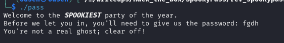
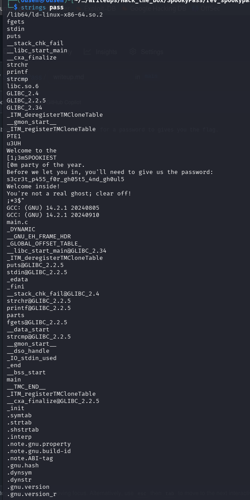
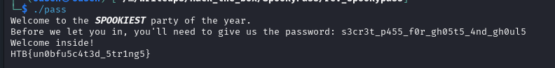

**🧠 SpookyPass (Reversing – Easy)**  
This challenge presents a binary that prompts the user for a password. Upon entering the correct password, it reveals the flag.  
  
**🕵️ Challenge Overview**  
When running the program, it simply asks for a password:  
  
  
  
Instead of reverse-engineering the binary in depth, we can apply a quick static analysis trick.  
  
**🔍 Solution – Using strings**  
We use the strings command to inspect human-readable strings inside the binary. This often reveals hardcoded values — like the password:  
Scrolling through the output, we find a suspicious string that looks like a password:  
  

✅ Entering the Password
Running the binary again and entering the discovered password gives us the flag:  
  

Flag  
HTB{un0bfu5c4t3d_5tr1ng5}  
