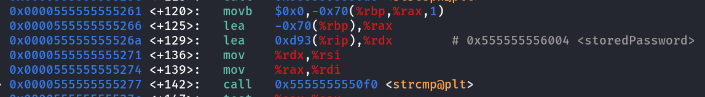
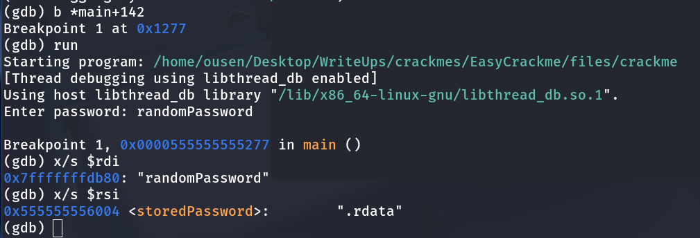

**Easycrackme**  
This challenge is super easy, the program asks for password, you can easily extract readable strings using "strings" command,  
but in this challenge I choose debagging it using gdb, here are the steps:  
  
  
As you can see, the program using strcmp function to compare between two strings, so one of them is the password.  
I maked a breakpoint in strcmp function then run the program again.  
  
  
  
I tried to enter random strings, then continue running the program.  
Then we can display the values in strcmp's parameters, one of them is my input, so the other is the password.  
  

As we can see, we confirmed that it is the correct password  
  

