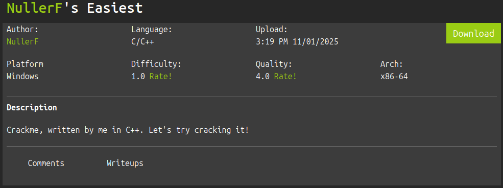

challenge link: https://crackmes.one/crackme/6906250b2d267f28f69b7a50

```
ousen@0u5en $ file easiest.exe 
easiest.exe: PE32+ executable (console) x86-64, for MS Windows, 16 sections
```
the binary is windows executable so we need wine to run it, because I am using linux
```
ousen@0u5en $ wine easiest.exe 
MESA-INTEL: warning: Haswell Vulkan support is incomplete
MESA-INTEL: warning: Haswell Vulkan support is incomplete
MESA-INTEL: warning: Haswell Vulkan support is incomplete
MESA-INTEL: warning: Haswell Vulkan support is incomplete
Enter PIN: ATUWVSH
Incrorrect :/
```
the program takes input and check if it is correct, I used radare2 to analyse it:
```
ousen@0u5en $ r2 easiest.exe 
[0x14000134a]> aaa
[x] Analyze all flags starting with sym. and entry0 (aa)
[x] Analyze function calls (aac)
[x] Analyze len bytes of instructions for references (aar)
[x] Finding and parsing C++ vtables (avrr)
[x] Type matching analysis for all functions (aaft)
[x] Propagate noreturn information (aanr)
[x] Integrate dwarf function information.
[x] Use -AA or aaaa to perform additional experimental analysis.
[0x14000134a]> afl
0x14000134a    1 27           entry0
0x140001001   46 812          sym.__tmainCRTStartup
0x140001000    1 1            sym.__mingw_invalidParameterHandler
0x14000132d    1 29           sym.WinMainCRTStartup
0x140001365    1 5            sym.atexit
0x14000ab98    1 6            sym._crt_atexit
0x140001370    1 12           sym.__gcc_register_frame
0x14000137c    1 1            sym.__gcc_deregister_frame
0x140001380    4 116          sym.main
0x140001400    4 36           sym.__do_global_dtors
0x140001424    7 72           sym.__do_global_ctors
.
.
.
0x14000aba8    1 6            sym.exit
0x14000ab68    1 6            sym._errno
0x14000ac20    1 6            sym.strlen
0x14000ac50    1 6            sym.vfprintf
0x14000abc0    1 6            sym.free
0x14000a090    3 63           fcn.14000a090
```
aaa for analyse the binary and afl to see the functions, I used pdf to disassemble the main function:
```
[0x14000134a]> pdf @ sym.main
            ; CALL XREF from sym.__tmainCRTStartup @ 0x1400012ee
┌ 116: int sym.main (int argc, char **argv, char **envp);
│           ; var int64_t var_4h @ rbp-0x4
│           0x140001380      55             push rbp
│           0x140001381      4889e5         mov rbp, rsp
│           0x140001384      4883ec30       sub rsp, 0x30
│           0x140001388      e8df000000     call sym.__main
│           0x14000138d      c745fc000000.  mov dword [var_4h], 0
│           0x140001394      488d0565ac00.  lea rax, str.Enter_PIN:_   ; section..rdata
│                                                                      ; 0x14000c000 ; "Enter PIN: "
│           0x14000139b      4889c1         mov rcx, rax               ; int64_t arg1
│           0x14000139e      e86d0c0000     call sym.__mingw_printf
│           0x1400013a3      488d45fc       lea rax, [var_4h]
│           0x1400013a7      488d0d5eac00.  lea rcx, [0x14000c00c]     ; "%d" ; int64_t arg1
│           0x1400013ae      4889c2         mov rdx, rax               ; int64_t arg2
│           0x1400013b1      e8da0c0000     call sym.__mingw_scanf
│           0x1400013b6      8b45fc         mov eax, dword [var_4h]
│           0x1400013b9      3d79210000     cmp eax, 0x****
│       ┌─< 0x1400013be      7511           jne 0x1400013d1
│       │   0x1400013c0      488d0548ac00.  lea rax, str.Correct__by_NullerF ; 0x14000c00f ; "Correct! by NullerF"
│       │   0x1400013c7      4889c1         mov rcx, rax               ; int64_t arg1
│       │   0x1400013ca      e8410c0000     call sym.__mingw_printf
│      ┌──< 0x1400013cf      eb0f           jmp 0x1400013e0
│      ││   ; CODE XREF from sym.main @ 0x1400013be
│      │└─> 0x1400013d1      488d054bac00.  lea rax, str.Incrorrect_:_ ; 0x14000c023 ; "Incrorrect :/"
│      │    0x1400013d8      4889c1         mov rcx, rax               ; int64_t arg1
│      │    0x1400013db      e8300c0000     call sym.__mingw_printf
│      │    ; CODE XREF from sym.main @ 0x1400013cf
│      └──> 0x1400013e0      488b0511ff00.  mov rax, qword [sym.imp.msvcrt.dll__getch] ; [0x1400112f8:8]=0x115d6 reloc.msvcrt.dll__getch
│           0x1400013e7      ffd0           call rax
│           0x1400013e9      b800000000     mov eax, 0
│           0x1400013ee      4883c430       add rsp, 0x30
│           0x1400013f2      5d             pop rbp
└           0x1400013f3      c3             ret
```
we noticed a comparison after taking the input from scanf ```cmp eax, 0x2179```, and after that it checks if it correct or not, so 0x**** is the correct PIN.
I converted it to decimal and gave it to the program, and it prints Correct.
```
ousen@0u5en $ printf "%d\n" 0x****
****
ousen@0u5en $ wine easiest.exe 
MESA-INTEL: warning: Haswell Vulkan support is incomplete
MESA-INTEL: warning: Haswell Vulkan support is incomplete
MESA-INTEL: warning: Haswell Vulkan support is incomplete
MESA-INTEL: warning: Haswell Vulkan support is incomplete
Enter PIN: ****
Correct! by NullerF
```
