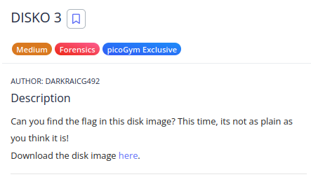

the hint in the challenge tells that you have to search and extract files in the partition, so we will mount the partition and search inside it about the flag file:
```
ousen@0u5en $ fdisk -l disko-3.dd 
Disk disko-3.dd: 100 MiB, 104857600 bytes, 204800 sectors
Units: sectors of 1 * 512 = 512 bytes
Sector size (logical/physical): 512 bytes / 512 bytes
I/O size (minimum/optimal): 512 bytes / 512 bytes
Disklabel type: dos
Disk identifier: 0x00000000

ousen@0u5en $ sudo mount -o loop,offset=$((START_SECTOR*512)) disko-3.dd /mnt
```

the disk has these files, we notice that there is flag.gz file:

```
ousen@0u5en $ ls /mnt/log/
alternatives.log          dpkg.log.2.gz             lastlog                   vmware-network.2.log      vmware-vmsvc-root.3.log
alternatives.log.2.gz     dpkg.log.4.gz             lightdm/                  vmware-network.3.log      vmware-vmsvc-root.log
apt/                      dpkg.log.5.gz             macchanger.log.4.gz       vmware-network.4.log      vmware-vmtoolsd-root.log
boot.log                  faillog                   mysql/                    vmware-network.5.log      wtmp
boot.log.1                flag.gz                   private/                  vmware-network.6.log      Xorg.0.log
boot.log.5                inetsim/                  stunnel4/                 vmware-network.7.log      Xorg.0.log.old
boot.log.6                installer/                syslog.3.gz               vmware-network.8.log      
daemon.log                journal/                  syslog.4.gz               vmware-network.log        
debug                     kern.log.3.gz             sysstat/                  vmware-vmsvc-root.1.log   
dpkg.log.1                kern.log.4.gz             vmware-network.1.log      vmware-vmsvc-root.2.log
```

so we will extract it and cat it:

```
ousen@0u5en $ sudo gunzip /mnt/log/flag.gz 

ousen@0u5en $ cat /mnt/log/flag 
Here is your flag
picoCTF{n3v3r_z1p_2_h1d3_654235e0}
```
