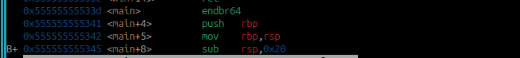

**PIE TIME**  
  
This challenge gives you the address of the main function, and asks for address to jum to.
  
  
Using ghidra we found a function named win, we have to find its address.  
  
  
Using gdb on asm layout, we took there addresses and we fount 150 between them  
  
  
  
At the end we too main function address and subtruct 150 to get win function's address  
  
  
  
**The Flag**  
picoCTF{b4s1c_p051t10n_1nd3p3nd3nc3_80c3b8b7}  

